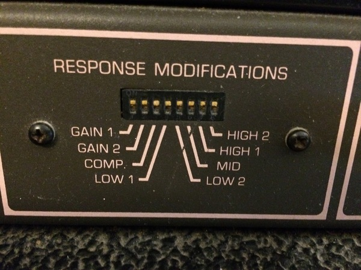

Thanks for sticking around! My second installment is a bit longer but I plan
to settle on a word count soon enough.  
  
* * *  
  

"Set phasers to 11." -- Star Trek: Spinal Tap Edition  
  
The New Console and the Art of IT  
  
[Jay Cuthrell 🤓💡🚀☁ on Twitter: "Great quote on new IT paradigms: "This is not a world of wizards and clicky clicky anymore." -- @jtroyer https://t.co/DW06v30scE"](https://twitter.com/JayCuthrell/status/813100554150965249?utm_campaign=Fudge%20Sunday&utm_medium=email&utm_source=Revue%20newsletter)

[twitter.com](https://twitter.com/JayCuthrell/status/813100554150965249?utm_campaign=Fudge%20Sunday&utm_medium=email&utm_source=Revue%20newsletter) – [Share](http://rev.vu/PQGRA?utm_campaign=Issue&utm_content=share&utm_medium=email&utm_source=Fudge+Sunday)

John always has great sound bites.  
  
Part of the joy in listening to podcasts is that you can have moments where
you are nodding your head and saying “yes” out loud. Of course, there are also
moments where you might shake your head and say “what the…” but that’s less
likely in podcasts you really enjoy.

I really do enjoy [The Cloudcast](http://www.thecloudcast.net/?utm_campaign=Fudge%20Sunday&utm_medium=email&utm_source=Revue%20newsletter). Episode #278 with John Troyer provided a great quote that I wanted to attempt to unpack: [_“This is not a world of wizards and clicky clicky anymore”_](http://www.thecloudcast.net/2016/11/the-cloudcast-278-automatic-devops-for.html?utm_campaign=Fudge%20Sunday&utm_medium=email&utm_source=Revue%20newsletter).

My IT career background is maybe a bit odd in that I learned UNIX before I
learned DOS. I didn’t get my first Windows machine until well after I had been
running Linux (badly) and getting my feet wet with Digital UNIX, SGI Irix, HP-
UX, IBM AIX, and… Mac OS was just a way to get a terminal session going on a
UNIX host. Hah.

I am proud of my command line interface (CLI) origins. I’m not ashamed.

I’ve always enjoyed the command line. I’ve also, at times, bristled at wizards
or other step by step means of getting something done on a computing platform.
I guess I would rather read the man page.

So it is a curious time to be in the IT industry as decades of wizard driven,
step, step, step, done approaches to interacting with compute / network /
storage / virtualization are reaching a pinnacle of sorts. Indeed, from
PowerShell to a new appreciation of Linux there are more folks wanting to drop
the GUI in favor of command line or – at the very least – mix and match.

Perhaps you have met another IT professional that has only recently discovered
command line, Linux, or a world where clicking Next in a GUI isn’t the only
way to get things done. It is eye opening to see origins of bespoke component
level configurations finding a new way with keystrokes.

And yet, on the other side of the IT spectrum (if there is such a thing) are
those that have started command line and ended up chasing the dragon in
pursuit of all that scales. You’ve met those folks. You might even be those
folks. Go distributed systems or go home.

Like most pained metaphors, the world of GUI and CLI are not so much a horse
race as much as they are about the convergence taking place in the user
experiences foisted upon the humble IT person of tomorrow. Both the GUI and
the CLI can and will coexist.

That said, there will be shock to those that have only lived in one reality of
GUI or CLI. It isn’t a question of if but when as Gibson’s future becomes more
evenly distributed.

For example, just pick on part of the IT stack… say, networking. Marketing and
rhetoric around how networking will operate in a (more) modern way hit peaks
in the past year or two. Yes. Software Defined Networking – sounds quaint now
eh?

Indeed, the same low level IP networking gear that required an industry
standard incantation on a command line is already fast becoming the
application of a convention as opposed to purely configuration. It is likely
that the same mixing of realities can be said for the rest of a modern IT
stack.

Convergence will mean that sometimes [a wizard of clicky goodness](https://twitter.com/jtroyer?utm_campaign=Fudge%20Sunday&utm_medium=email&utm_source=Revue%20newsletter) will work just fine and other times it will be a language binding that provides immensely more objectively generated command sets than primitive command lines before it did. One size and one approach rarely fits all use cases.

Now, because it was drilled into my brain early in history of science and
technology classes, I carry around definitions. Science is that which explains
and predicts. Technology is the response to a perceived need. Art is a form of
expression using a developed skill.

So knowing both ways, GUI and CLI, will matter more now and even more in the
future. More importantly, knowing when one way or the other makes the most
sense will be how the _science_ of IT swings back into the _art_ of IT.  
