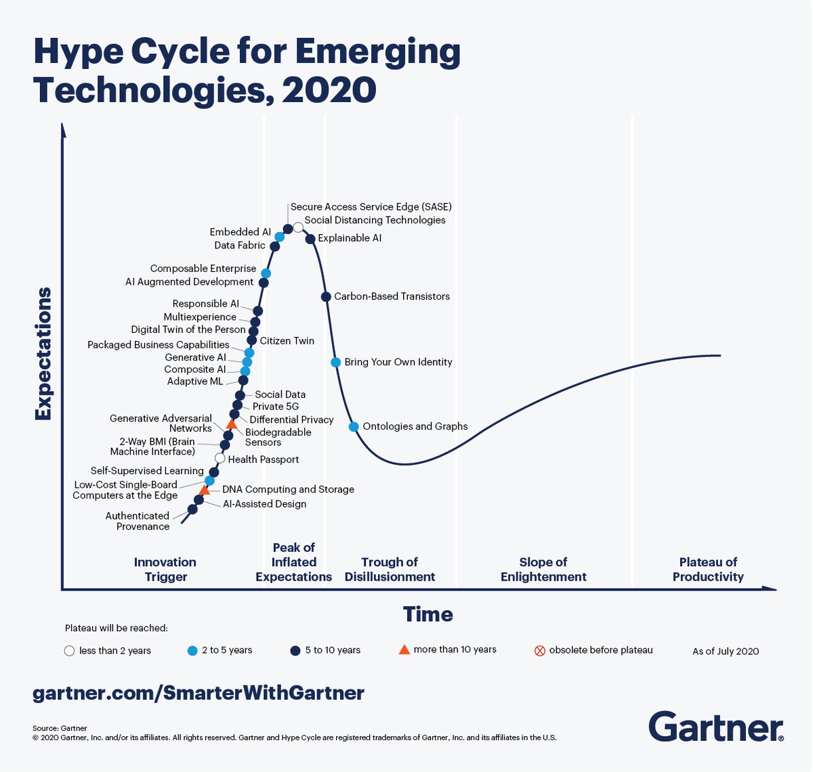
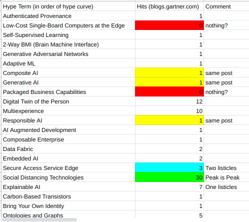

On a hunch, I searched [Gartner blogs](https://blogs.gartner.com) for specific keywords from the [Gartner Hype Cycle for Emerging Technologies, 2020](https://www.gartner.com/en/newsroom/press-releases/2020-08-18-gartner-identifies-five-emerging-trends-that-will-drive-technology-innovation-for-the-next-decade).

_Source:_ [Gartner Identifies Five Emerging Trends That Will Drive Technology Innovation for the Next Decade](https://www.gartner.com/en/newsroom/press-releases/2020-08-18-gartner-identifies-five-emerging-trends-that-will-drive-technology-innovation-for-the-next-decade)

# Survey Says...

It turns out that the Peak of Inflated Expectations matched the Peak of Inflated Blog Post Themes:

*"Social Distancing Technologies"* enjoyed the top topic spot.

The results makes sense for a few reasons. 

- Clearly, at the time of this publication a large portion of humanity is thinking about the implications of pandemic responses ranging from social distancing and the enabling technologies being leveraged, refined, and created in response to our collective perceived needs.
- Thinking about things leads to blogging about things.
- Blogging tools, while accessible, are not the primary output model since in depth research is behind a paywall.
- Blogging at Gartner has only been a formal content channel since late 2008.
- In 2008, social sharing included other online properties such as Digg, del.icio.us, Facebook, Google, LinkedIn, Live, NewsVine, Reddit, Slashdot, and StumbleUpon
- In 2020, social sharing survivors include only LinkedIn and the later added Twitter.

The resulting content raises a few questions as well.

- Teasing out a topic and deep linking to research might seem useful but what are the actual conversion metrics?
- Why would anyone come through a blog to get to research behind a paywall? 
- Does the search for a blog post leverage the same content management for research collateral or is it a silo?
- Is sharing to LinkedIn or to Twitter effective when the paywall grade research is rarely seen outside direct engagements with an analyst?

My guess? Unlikely.

It's also worth remembering that these technologies are emerging (not emerged) and certainly not applied, vetted, measured, or refined.

# Predictions? 

Keep an eye on the _"Digital Twin"_ topic which enjoyed a high number of blog posts as well.

- Even before the current pandemic there were accelerating societal needs for abstractions from the physical world.
- Post current pandemic, abstractions and collections of abstractions will come to represent new ways of interacting with the physical world and each other socially.
- The term _"Digital Twin"_ is sufficiently broad enough to sweep in many more stories (and blog posts!) in the coming years.

The Slope of Enlightenment will require many snacks along the way...

[Originally based upon a Twitter thread](https://threadreaderapp.com/thread/1297705293913227270.html)
