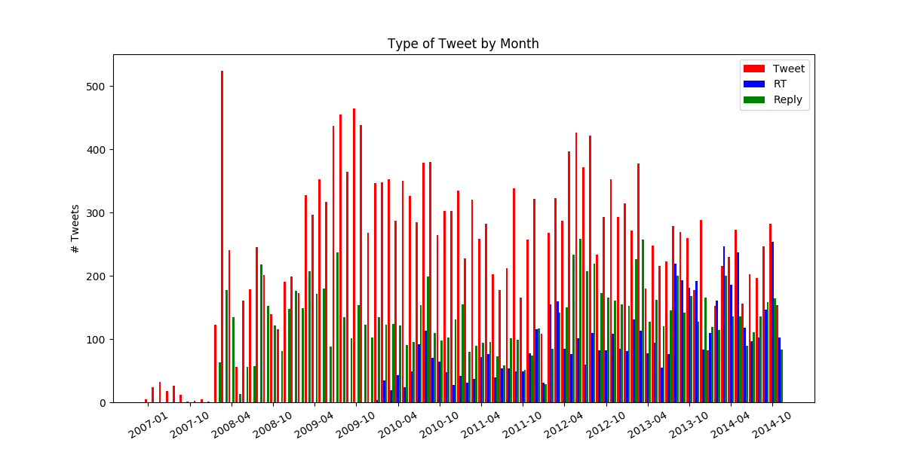
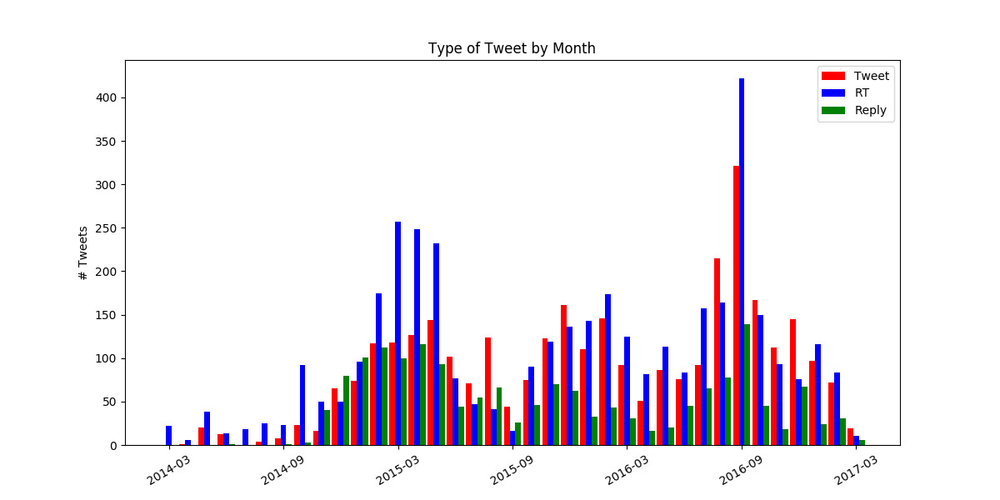
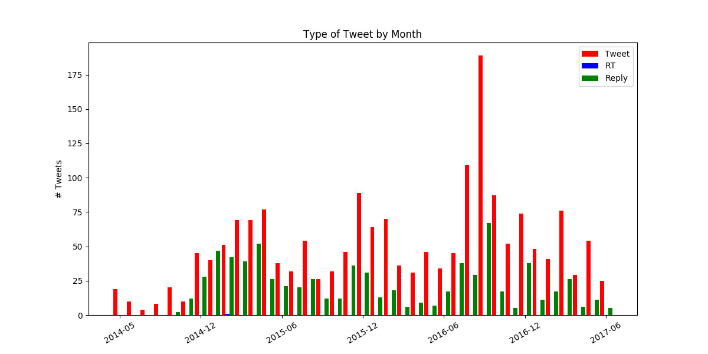

A few days ago I reset almost all of my primary Twitter output since 2007.

First, I made archives to revisit some prior analysis.

Next, I started looking around on GitHub for inspiration. 

Little Big Data
===============

A few years ago I did a big data presentation. There was even a video of it. _(Update: the video appears to be private as of 2022)_

At the time, I had downloaded some R examples to run against my Twitter archives.

Why archives? I tweet(ed) a lot. So, [the limitations on web
access](https://dev.twitter.com/rest/public/rate-limits) applied.

I included [some of these references in the presentation](https://gist.github.com/JayCuthrell/8bcd9597d37a8602c639).

Trends: @Qthrul
===============

This time around I found another example using Python:

[https://github.com/dangoldin/twitter-archive-analysis](https://github.com/dangoldin/twitter-archive-analysis)

A few seconds later... this caught my eye for @Qthrul:

It is clear that functionality arrived (retweet) and that I was interactive
(replies).

Trends: @JayCuthrell and @JayAtDellEMC
======================================

But I had also created other Twitter accounts. 

Let's take a look at @JayCuthrell:

Let's take a look at @JayAtDellEMC:

I'll revisit this post as I come across more tools with good results.

