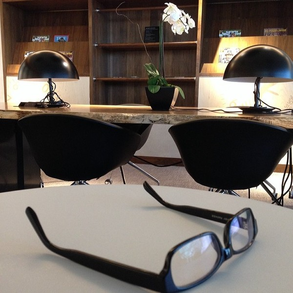
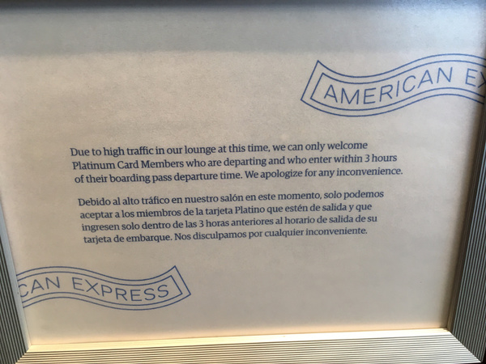
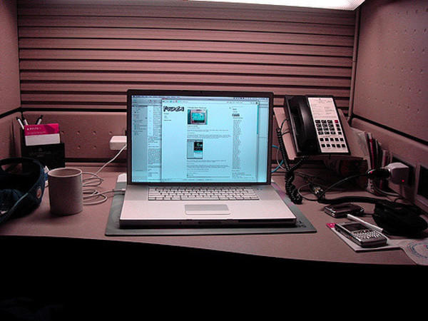
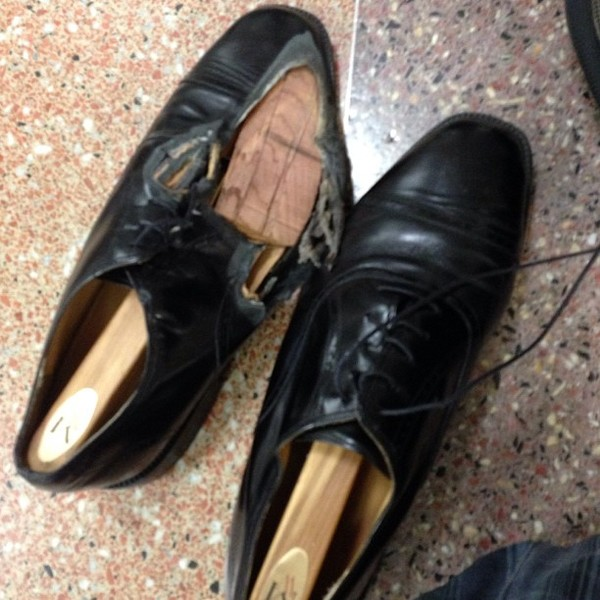

If you follow my annual blog updates you already know [I’ve been off the road for just over a year](https://fudge.org/my-eighth-year-at-vce/?utm_campaign=Fudge%20Sunday&utm_medium=email&utm_source=Revue%20newsletter). As with any decrease in travel frequency there are opportunities to learn and plan for an eventual increase. This week I’ll explore some of the things I’ve learned over the past +20 years of being in regular motion around the globe.  
  
* * *  
  

My office at the peak of my North American travel... the AMEX Lounge in LAS  
  
# Membership Had Its Privileges
  
One of the early benefits of carrying around specific brands of credit cards
in your wallet is airport lounge access. The idea was that for loyalty (and
paying a yearly fee) there was a perk to allow subsidized access to the
airport lounge of the carrier printed on the card or even a few different
lounges (as with American Express).  
  
If you follow travel blogs or travel rewards forums then you also know that
the math to keep up with changes in programs, perks, and entitlements is fast
becoming 400 level math.  
  
Personally, I’ve carried around AMEX cards and Delta specific cards. However,
there are fewer reasons to carry and more caveats than before as wider pools
of participation occur through the wonders of corporate expense policy seeking
to provide great perks year over year. Even my beloved American Express
Centurion Lounge in Las Vegas was not immune to the spoils of its own success.  
  

Seriously.  
  
# The 1st Wave: 1999-2006
  
From 1999 to 2002 there was a lot of travel I signed up for as a global .com
era consultant dealing with software and systems engineering or what was then
called infrastructure engineering. Sometimes I would have down time and blog
but most of it was pithy and ubiquitous connectivity like broadband was still
just become a reality around the globe. Dial-up was pretty common unless you
were in an office, had two channels of ISDN at home or the first of the xDSL
or maybe even pre-DOCSIS cable internet services at home.  
  
[Tel Aviv Traceroute ( 2000 )](https://fudge.org/tel-aviv-traceroute/?utm_campaign=Fudge%20Sunday&utm_medium=email&utm_source=Revue%20newsletter)

[jaycuthrell.com](https://fudge.org/tel-aviv-traceroute/?utm_campaign=Fudge%20Sunday&utm_medium=email&utm_source=Revue%20newsletter) – [Share](http://rev.vu/69bRb4?utm_campaign=Issue&utm_content=share&utm_medium=email&utm_source=Fudge+Sunday)

Because it’s totally normal to blog about a traceroute?  
  
There was a time when a flight from RDU to EWR was $88 round trip on an
airline that no longer exists. That year was 2001 and it was in the wake of
9/11.  
  
[.jpg) ](https://fudge.org/here-it-comes/?utm_campaign=Fudge%20Sunday&utm_medium=email&utm_source=Revue%20newsletter)[Here It Comes ( 2001 )](https://fudge.org/here-it-comes/?utm_campaign=Fudge%20Sunday&utm_medium=email&utm_source=Revue%20newsletter)

[jaycuthrell.com](https://fudge.org/here-it-comes/?utm_campaign=Fudge%20Sunday&utm_medium=email&utm_source=Revue%20newsletter) – [Share](http://rev.vu/WRNDWv?utm_campaign=Issue&utm_content=share&utm_medium=email&utm_source=Fudge+Sunday)

It was another time.  
  
Eventually, travel that was less _normal_ became accepted as _normal_. You learned to expect more security and scrutiny or the random change to policy or procedures. [Long live the freedom grope](https://www.tsa.gov/news/releases/2013/07/19/tsa-launch-application-program-tsa-precheck?utm_campaign=Fudge%20Sunday&utm_medium=email&utm_source=Revue%20newsletter).  
  
# Jay's Way Circa 2007
  
The iPhone became reality in 2007. There were caveats that made it less than
an ideal travel phone back then. For example, there was one carrier in those
days if you wanted to have the iPhone.  
  

The year was 2007: Laptop. Wifi. Blackberry. Flip Phone.  
  
Around this same time, I was asked if I could describe the ideal road warrior
approach. Luckily, I wrote it down so that I can now reflect on the
assumptions and some of the absurdities through a lens some 12 years later.

This is how to work from the road.

1) Have access to a quiet place with no harsh overhead lighting, no screaming
announcements, plentiful AC power, free scratch pads and pens, free drinks and
snacks (Delta Crown Room via AMEX perks or buy one)

2) Have access to quality wireless OR wired Internet (via T-Mobile pay as you
go)

3) Have a laptop and mobile phone.

4) Have a backup mobile phone that uses the same type of storage card that can
be read by the other phone and laptop.

5) Have a land line with a DID.

6) Have a 12V charger that lets you carry -one- kind of car charger per mobile
phone

7) Drink lots of coffee during layovers  
  
This list seemed quaint until I reviewed my current carry on bag. (See below
for the 2019). In fact, now I carry two laptops and two mobile phones on two
different carriers and have memberships to two (or three) different lounges.
I’m not sure if this is progress or simply refining my desired level of backup
and redundancy options. Yes. That must be it.  
  
# Jay's Way Circa 2010
  
After semi-retiring and consulting for a few years it was getting easier to
travel when I wanted and where I wanted. Broadband was really hitting stride
and the number of companies innovating in streaming collaborative screen
sharing were on the rise. It was a time when proxemics and being there were
quickly becoming more than just a richer conference call.  
  
[.jpg) ](https://fudge.org/airwaves-vs-airlines/?utm_campaign=Fudge%20Sunday&utm_medium=email&utm_source=Revue%20newsletter)[Airwaves vs Airlines ( 2010 )](https://fudge.org/airwaves-vs-airlines/?utm_campaign=Fudge%20Sunday&utm_medium=email&utm_source=Revue%20newsletter)

[jaycuthrell.com](https://fudge.org/airwaves-vs-airlines/?utm_campaign=Fudge%20Sunday&utm_medium=email&utm_source=Revue%20newsletter) – [Share](http://rev.vu/dM8V7O?utm_campaign=Issue&utm_content=share&utm_medium=email&utm_source=Fudge+Sunday)

In which I wondered if there was a better way to be _there_.  
  
Eventually, the patterns of modern audio, video, and screen based
collaboration gave way to memes. The memes were funny because there was and is
a root of truth to them.  
  
[A Conference Call in Real Life](https://www.youtube.com/watch?utm_campaign=Fudge%20Sunday&utm_medium=email&utm_source=Revue%20newsletter&v=kNz82r5nyUw)

[www.youtube.com](https://www.youtube.com/watch?utm_campaign=Fudge%20Sunday&utm_medium=email&utm_source=Revue%20newsletter&v=kNz82r5nyUw) – [Share](http://rev.vu/JyqKqP?utm_campaign=Issue&utm_content=share&utm_medium=email&utm_source=Fudge+Sunday)

Trigger warning. :-)  
  
Since 2010 the sheer number of miles I’ve traveled is staggering. Just
becoming a Million Miler on _one_ of the many carriers I fly was enough to
remind me I should probably consider offsets or credits for my carbon
footprint. Thankfully there are causes to make me feel better about my
consumption. Also, I look forward to how I travel differently and smarter in
the years ahead should I be fortunate enough to continue to travel be it for
work or not work work.  
  
# Jay's Way Circa 2019  
  
As I look ahead to 2019 and beyond, I’m learning that less is more and that
planning ahead makes a huge impact on road warrior duties. So, what’s in my
carry on bag these days?  
  
  * Two laptops. One for work. One for not work work.
  * High wattage power adapater. Works for both laptops to ensure full performance and avoid stepping down the CPUs.
  * Two mobile phones on two different carrier. One for work. One for not work work. Hotspot plans.
  * Full size charging brick with cables for each phone.
  * Three lounge memberships. Delta. American Airlines. AMEX Centurion.
  * Brookhaven slim backpack or a larger padded Columbia backpack.

  
  
The system for getting and traveling well has changed up quite a bit as well.
The options available in 2019 are far different and far more convenient than
20 years ago.  
  
  * Lyft and the like obviate the need to drive a vehicle to the airport and pay for the right to dealing with parking deck fee payment kiosks. The math usually works out to be better for a trip of less than 3-4 days.
  * If you are part of a global road warrior program through your workplace, go ahead and find the lounge you like vs the carrier you plan to fly most. Dietary considerations are important and knowing what lounges have good electrical and wifi coverage is more important than distance to your gate. Just remember that everyone else traveling like you probably has the same idea and crowding will continue as travel becomes less of a treat and more of an expectation. 
  * Most airports are large enough to be wonderful hiking from one end of the terminal to the next – and bonus points for having defibrillators and emergency response staff if you’ve fallen and can’t get up. The importance of a comfortable backpack is important. 
  * Check your big bag. Just check it. That means trusting the process of checking a bag… even I’ve learned that sometimes you win and sometimes you get dragged down the tarmac and delivered on baggage carousel in a smoldering heap of burnt leather and ripped wool. You can replace your shoes and pants. You can’t replace the freedom of a nice walk with a backpack through the terminal.
  * National health club membership because poor hotel gyms aren’t an excuse not to get in gym time.
  * Keyless checkin is still a bit of a gimmick but useful when you get into the hotel after front desk staffing levels are less than ideal. Else, get an actual card when you can and especially if it is proximity based vs. Wiegand code strip aka mag stripe style. Those mag stripe style cards still fail from all the magnets used in mobile phones.

  
  

That's why all my measurements are on file at Men's Wearhouse.  
  
# The Next Wave: 2020 and beyond  
  
That’s all for now. Thanks again for subscribing and… get ready for even more
crowding in those airport lounges.  
  
[Growth of global air traffic passenger demand 2019](https://www.statista.com/statistics/193533/growth-of-global-air-traffic-passenger-demand/?utm_campaign=Fudge%20Sunday&utm_medium=email&utm_source=Revue%20newsletter)

[www.statista.com](https://www.statista.com/statistics/193533/growth-of-global-air-traffic-passenger-demand/?utm_campaign=Fudge%20Sunday&utm_medium=email&utm_source=Revue%20newsletter) – [Share](http://rev.vu/R3ldxx?utm_campaign=Issue&utm_content=share&utm_medium=email&utm_source=Fudge+Sunday)

Here comes another six percent on top of the rising trend  
