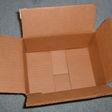
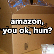
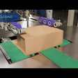
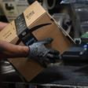
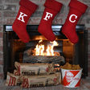

  
  
Now that China has said “no thank you” to scrap recycling imports, there is a good chance [the familiar cardboard recycling bin will take on greater significance](https://www.wastedive.com/news/what-recycling-end-market-development-looks-like-in-2019/553683/?utm_campaign=Fudge%20Sunday&utm_medium=email&utm_source=Revue%20newsletter) as the piles… continue to make a bigger pile. This week, let’s take a look at the humble cardboard box.  
  
* * *  
  
# Humble Origins  
  
Over the past 200 years there have been cardboard boxes big and small. The
advent of global shipping and ever quickening supply chain technologies have
only served to increase awareness of the cardboard box.  
  
[1817 - Cardboard is born](https://en.wikipedia.org/wiki/Cardboard_box?utm_campaign=Fudge%20Sunday&utm_medium=email&utm_source=Revue%20newsletter#History)

[en.wikipedia.org](https://en.wikipedia.org/wiki/Cardboard_box?utm_campaign=Fudge%20Sunday&utm_medium=email&utm_source=Revue%20newsletter#History) – [Share](http://rev.vu/4KPY8O?utm_campaign=Issue&utm_content=share&utm_medium=email&utm_source=Fudge+Sunday)

200 years of boxes.  
  
From inception to meme took roughly 200 years for the cardboard box. Now, the
cardboard box is a keystroke away to help us all express ourselves faster than
ever before.  
  
[2015 - The 📦 Package Emoji](https://emojipedia.org/package/?utm_campaign=Fudge%20Sunday&utm_medium=email&utm_source=Revue%20newsletter)

[emojipedia.org](https://emojipedia.org/package/?utm_campaign=Fudge%20Sunday&utm_medium=email&utm_source=Revue%20newsletter) – [Share](http://rev.vu/nanr4P?utm_campaign=Issue&utm_content=share&utm_medium=email&utm_source=Fudge+Sunday)

You know you’ve made it when you are enshrined in a Unicode update.  
  
Then again, by 2015, Amazon had become notorious due to a combination of
expanding fulfillment options, smart phones, social media, and the seemingly
unquenchable thirst for newly minted viral ready memes on the Interwebs.  
  
[2015 - Amazon Packaging Memes](https://www.buzzfeed.com/morenikeadebayo/amazon-packaging-needs-to-chill-the-fuck-out?utm_campaign=Fudge%20Sunday&utm_medium=email&utm_source=Revue%20newsletter)

[www.buzzfeed.com](https://www.buzzfeed.com/morenikeadebayo/amazon-packaging-needs-to-chill-the-fuck-out?utm_campaign=Fudge%20Sunday&utm_medium=email&utm_source=Revue%20newsletter) – [Share](http://rev.vu/q6V0M5?utm_campaign=Issue&utm_content=share&utm_medium=email&utm_source=Fudge+Sunday)

Warning: NSFW title on this link but then again… it kinda had a point.  
  
# Bring in the Robots  
  
Amazon is no stranger to robotics. The early adoption of Kiva robots indicates
that fulfillment efficiency is a journey for Amazon, not simply a destination.  
  
[2017 - CartonWrap 1000](https://www.youtube.com/watch?utm_campaign=Fudge%20Sunday&utm_medium=email&utm_source=Revue%20newsletter&v=Ti2PnI5xh28)

[www.youtube.com](https://www.youtube.com/watch?utm_campaign=Fudge%20Sunday&utm_medium=email&utm_source=Revue%20newsletter&v=Ti2PnI5xh28) – [Share](http://rev.vu/kdJBxr?utm_campaign=Issue&utm_content=share&utm_medium=email&utm_source=Fudge+Sunday)

Come for the concept. Stay for the soundtrack.  
  
[2018 - CartonWrap 1000 refinements](https://www.youtube.com/watch?utm_campaign=Fudge%20Sunday&utm_medium=email&utm_source=Revue%20newsletter&v=9rP1wjEsbak)

[www.youtube.com](https://www.youtube.com/watch?utm_campaign=Fudge%20Sunday&utm_medium=email&utm_source=Revue%20newsletter&v=9rP1wjEsbak) – [Share](http://rev.vu/yonq83?utm_campaign=Issue&utm_content=share&utm_medium=email&utm_source=Fudge+Sunday)

The soundtrack to your single click e-commerce future is slightly lower
volume.  
  
[2019 - Commensurate Cardboard ](https://www.reuters.com/article/us-amazon-com-automation-exclusive-idUSKCN1SJ0X1?utm_campaign=Fudge%20Sunday&utm_medium=email&utm_source=Revue%20newsletter)

[www.reuters.com](https://www.reuters.com/article/us-amazon-com-automation-exclusive-idUSKCN1SJ0X1?utm_campaign=Fudge%20Sunday&utm_medium=email&utm_source=Revue%20newsletter) – [Share](http://rev.vu/aeKmrO?utm_campaign=Issue&utm_content=share&utm_medium=email&utm_source=Fudge+Sunday)

Amazon is extending more robotics to refine another aspect of the toothbrush
in gigantic cardboard box conundrum.  
  
# Recycling Innovations  
  
Looking ahead, there will be more opportunities to reclaim cardboard boxes in
ways that favor the paper industry as a whole. Growing more trees is a good
idea by almost any accounting of renewable resources.  
  
[2010 - The Sustainable Supply Chain](https://hbr.org/2010/10/the-sustainable-supply-chain?utm_campaign=Fudge%20Sunday&utm_medium=email&utm_source=Revue%20newsletter)

[hbr.org](https://hbr.org/2010/10/the-sustainable-supply-chain?utm_campaign=Fudge%20Sunday&utm_medium=email&utm_source=Revue%20newsletter) – [Share](http://rev.vu/56G1ra?utm_campaign=Issue&utm_content=share&utm_medium=email&utm_source=Fudge+Sunday)

10 years later… where are we?  
  
Creative ideas will emerge. Ideas that _smell_ like success will likely
succeed.  
  
[2018 - KFC Scent Infused Enviro-Log](https://boingboing.net/2018/12/13/kfc-introduces-a-firelog-that.html?utm_campaign=Fudge%20Sunday&utm_medium=email&utm_source=Revue%20newsletter)

[boingboing.net](https://boingboing.net/2018/12/13/kfc-introduces-a-firelog-that.html?utm_campaign=Fudge%20Sunday&utm_medium=email&utm_source=Revue%20newsletter) – [Share](http://rev.vu/8qed50?utm_campaign=Issue&utm_content=share&utm_medium=email&utm_source=Fudge+Sunday)

Fingerlickin’ good ideas are just around the corner.  
  
If anything, perhaps the days of the plastic water bottle will become a
footnote as boxed water and bio compost ready packaging takes hold in consumer
purchasing patterns.

So until next time, don’t print this newslestter…

But feel free to forward it via email to a peer.

:smile: 
